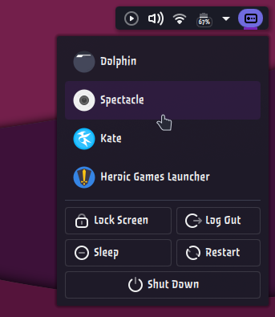
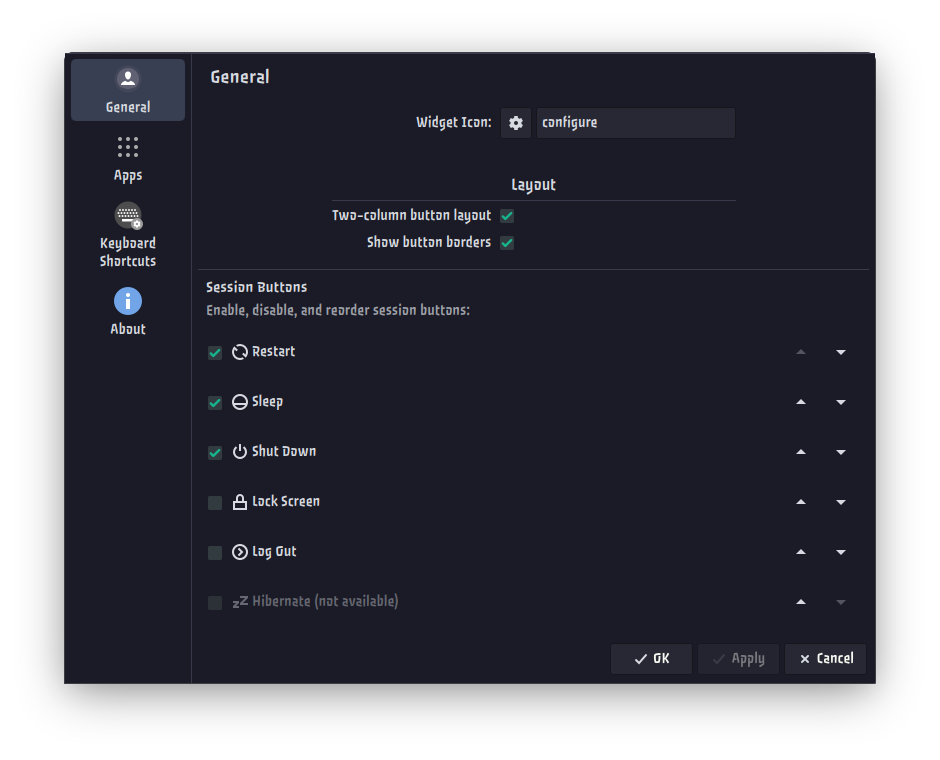
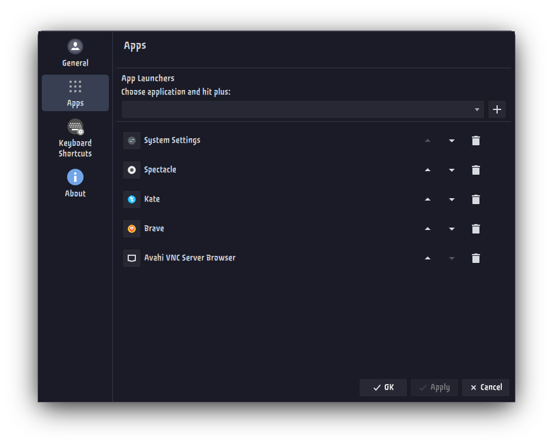

# SCP Menu Reborn — for KDE Plasma 6.6+

A clean, minimal KDE Plasma panel widget that provides a customizable power/session menu with app launcher shortcuts.

> Modified version of [SCP Menu](https://store.kde.org/p/2137217/) (GPL-2.0) by **Dervart**

## Features

- Configurable app launcher shortcuts
- **6 session buttons**: Lock Screen, Log Out, Restart, Sleep, Shut Down, Hibernate — each independently toggleable
- **Reorderable** session buttons and app launchers
- **Two-column or single-column** layout toggle for session buttons
- **Configurable button borders** for a more defined look (on by default)
- Customizable widget icon


## Screenshots






## Requirements

- KDE Plasma 6.6+
- KDE Frameworks 6
- Qt 6.x


## Installation

### Using kpackagetool (recommended)

```bash
kpackagetool6 -t Plasma/Applet -i .
```

Restart plasmashell:

```bash
systemctl --user restart plasma-plasmashell
```

or log out and log back in.

### Upgrading existing installation:

```bash
kpackagetool6 -t Plasma/Applet -u .
```
Restart plasmashell:

```bash
systemctl --user restart plasma-plasmashell
```

or log out and log back in.


### Uninstall

```bash
kpackagetool6 -t Plasma/Applet -r org.kde.plasma.scpmr
```
